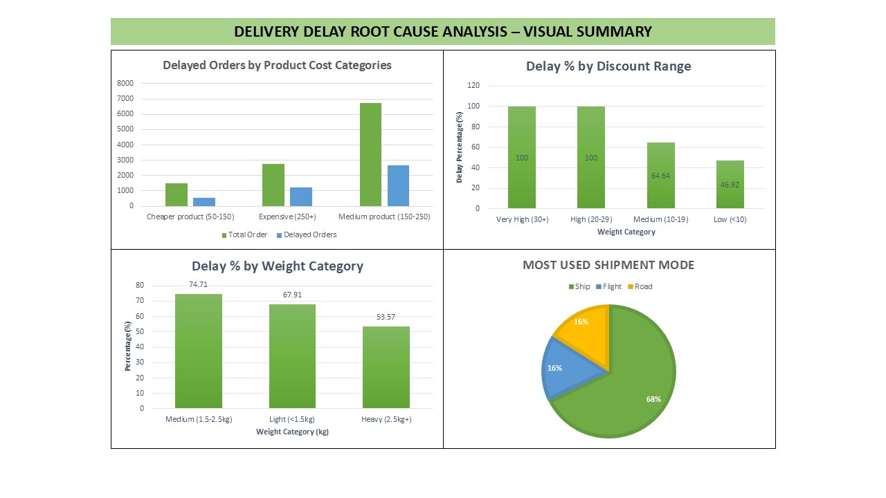

#  Delivery Delay Root Cause Analysis (SQL Project)

This project uses SQL to analyze the root causes of delivery delays in an international e-commerce company selling electronics.

---

##  Files Included

| File Name                     | Description                                 |
|------------------------------|---------------------------------------------|
| `delay_feature_analysis.sql` | Delay % by discount, product, weight, etc.  |
| `operational_insights.sql`   | Shipment mode, ratings, cost, weight trends |
| `customer_loyalty_analysis.sql` | Loyalty behavior & delay correlation     |
| `visuals_summary.jpeg`       | Final combined visual summary of findings   |
| `key_insights.md`            | Text summary of all key insights            |

---

##  Key Insights

 **100% delay for orders with 30%+ discounts**  
 **Medium-weight products (1.5–2.5kg) = 74% delay**  
 **More customer care calls reduce delivery delays**  
 **New customers face 62%+ delay**  
 **Expensive products take longer due to special handling**  

See full breakdown in [`key_insights.md`](key_insights.md)

---

##  Summary Visual

---

##  Skills Used

- SQL (MySQL)
- Data Cleaning & Categorization
- Root Cause Analysis
- Visualization (Excel)

---

##  Contact

Made by [Mihir Padekar]  
[LinkedIn](www.linkedin.com/mihirpadekar) 
